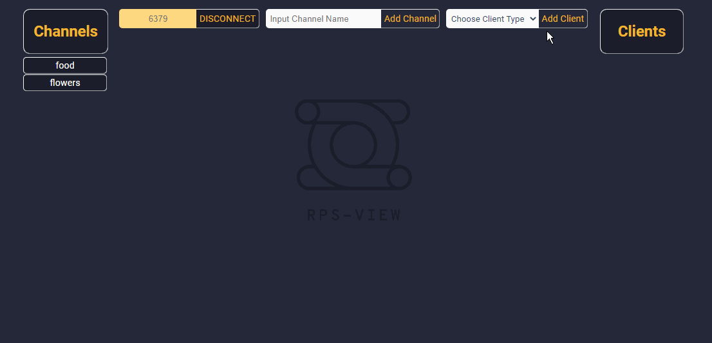
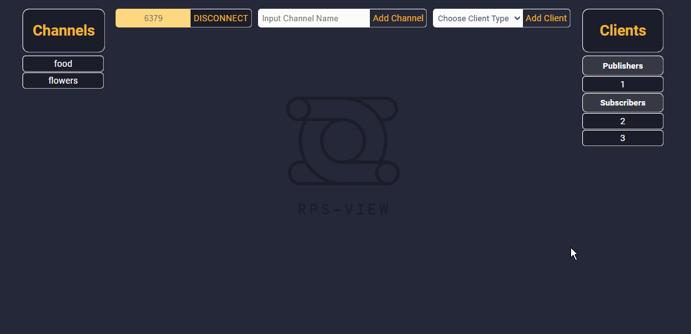
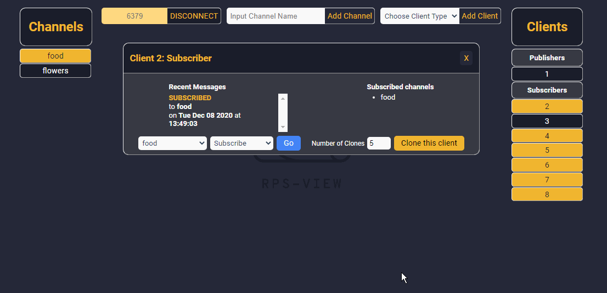

# RPS View - Electron Packager

An electron packager for RPS View

## Problem

Currently RPS View has Repository for running the app from electron or localhost, but needs a repository for bundling and distributing a electron app.

## Repo description

This repository allows you to bundle the electron app into downloadable form for Linux and Mac. The package bundles within the release-builds folder.

## Getting started

### To bundle the application

- [ ] `npm install`
- [ ] `npm run build` prepares the webpack bundle, which will allow us to package the most recent version of the app.
- [ ] `npm run package-mac` will package the electron app into a usable form for Mac OS
- [ ] `npm run package-linux` will package the electron app into a usable form for Linux OS
- [ ] `npm run package-win` Work in progress that will download into a usable form for Windows
- [ ] `npm run electron` will open the electron app. Allows the developer to view their code before bundling.

### Important Setup Notes

For testing the app within electron the following steps must be run.

- Express - You must be running an Express server on port 3000 for the application to work
- Redis-server - You must run a redis server - either in your application or on the command line to connect the app. Make sure you connect to the same port that your redis-server is running on. If no server is specified, the application will attempt to create a redis client on port 6379.

## Demonstration

### Connecting
The first thing you should do on RPS View is connect to the port on which your redis server is running. If no port is selected, the “Connect” Button will launch a  connection attempt on the default port for redis, ‘6379’.

### Adding channels and clients
After you’ve connected, you should see any existing channels in your redis-server instance on the channels menu to the left; you can also create new channels using the top menu bar.  

You can also add new clients (both publishers and subscribers) from the top menu bar. 

If you click on a particular subscriber in the client menu on the left, the client window will appear. From here, you can subscribe to and unsubscribe from any channel, as well as clone the current subscriber to easily create multiple clients with the same channel subscriptions.

### Publishing messages and viewing logs
You can publish from the terminal, from your application, or using a publisher's client window. You should see the new messages propagate in the message log of all clients currently subscribed to that channel.

## How to contribute

- We're an open source project, and we're open to new contributions. 
- Add an issue to the github issues before starting a new feature.
- Make pull requests to staging with issue referenced in the PR.

## Contact

Website: [http://www.rpsview.com/](http://www.rpsview.com/)

Github: [https://github.com/oslabs-beta/RPS-View](https://github.com/oslabs-beta/RPS-View)

### Team

- Elise Bare [@Github](https://github.com/elisebare) [@LinkedIn](https://www.linkedin.com/in/elisebare/)
- Joe Cheng [@Github](https://github.com/EtOh200) [@LinkedIn](https://www.linkedin.com/in/josephcheng-y/)
- Lara Nichols [@Github](https://github.com/Lol-Whut) [@LinkedIn](https://www.linkedin.com/in/lara-nichols-ba822279/)
- Mark Washkewicz [@Github](https://github.com/Mark-Waskewicz) [@LinkedIn](https://www.linkedin.com/in/mark-washkewicz/) 

### License

Distributed under the MIT License. 

