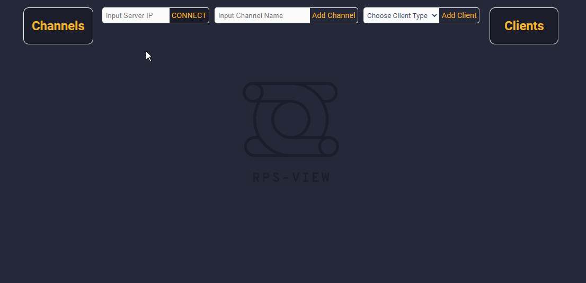
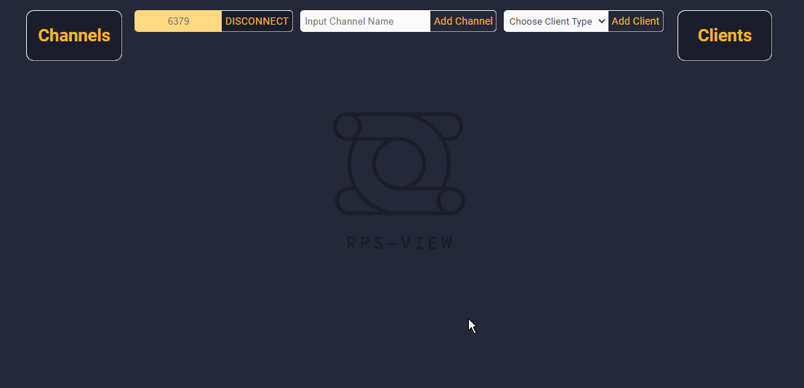

# RPS View - Beta version

A web or desktop application to assist in visualization and monitoring of redis pub-sub clients.

### Problem

Testing your Redis pub sub clients in development requires multiple redis cli clients. Our tool allows you to create publishers and subscribers and channels in one place and monitor receipt of messages.

### App description

This app allows you to track redis pub / sub messages with dummy clients. The app uses

- Express server
- Web sockets on 3030 to send messages to clients
- Redis IO to connect and subscribe clients
- Redux/React front end to manage state
- Redux Thunk middleware for fetch requests, asynchronous actions, and web socket message handling
- Jest & Supertest for unit tests and integration testing
- Electron for desktop cabailities

### Getting started

#### To run the application

- [ ] `npm install`
- [ ] Redis server must be open. Run `redis-server` if you don't already have a server up for your project.
- [ ] `npm run build` prepares the webpack bundle and only needs to run once
- [ ] `npm run start` runs the web app on local host 3000.
- [ ] You can run `npm run start-electron` to run an electron application.
- [ ] For development mode (hot reloading), run `npm run dev`. This will use proxy server 8080 in addition to port 3000.

#### Important Setup Notes

- Express - You must be running an Express server on port 3000 for the application to work
- Redis-server - You must run a redis server - either in your application or on the command line to connect the app. Make sure you connect to the same port that your redis-server is running on. If no server is specified, the application will attempt to create a redis client on port 6379.

### Demonstration

#### Connecting
The first thing you should do on RPS View is connect to the port on which your redis server is running. If no port is selected, the “Connect” Button will launch a  connection attempt on the default port for redis, ‘6379’.

#### Adding channels and clients
After you’ve connected, you should see any existing channels in your redis-server instance. You can add clients from there, and subscribe them to the channels. 

#### Prublishing messages and viewing logs
You can publish from the terminal or your application, and you should see the new messages propagate in the message log of the respective clients.

### How to contribute

- We're an open source project, and we're open to new contributions. 
- Add an issue to the github issues before starting a new feature.
- Make pull requests to staging with issue referenced in the PR.

### Contact

Website: [http://www.rpsview.com/](http://www.rpsview.com/)

Github: [https://github.com/oslabs-beta/RPS-View](https://github.com/oslabs-beta/RPS-View)

### Team

- Elise Bare [@Github](https://github.com/elisebare) [@LinkedIn](https://www.linkedin.com/in/elisebare/)
- Joe Cheng [@Github](https://github.com/EtOh200) [@LinkedIn](https://www.linkedin.com/in/josephcheng-y/)
- Lara Nichols [@Github](https://github.com/Lol-Whut) [@LinkedIn](https://www.linkedin.com/in/lara-nichols-ba822279/)
- Mark Washkewicz [@Github](https://github.com/Mark-Waskewicz) [@LinkedIn](https://www.linkedin.com/in/mark-washkewicz/) 

### License

Distributed under the MIT License. 

